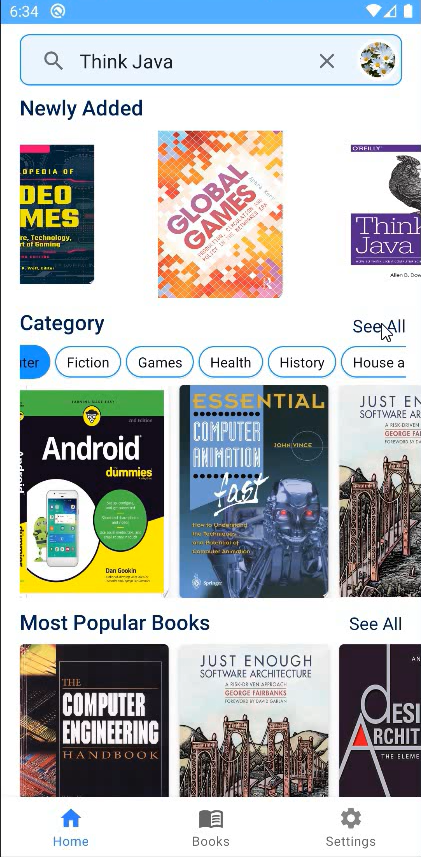
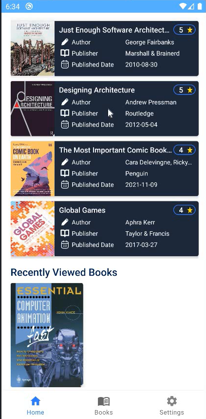
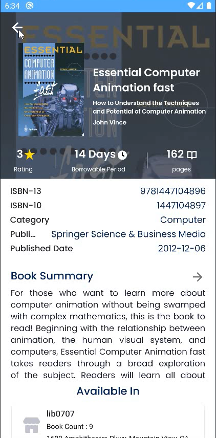
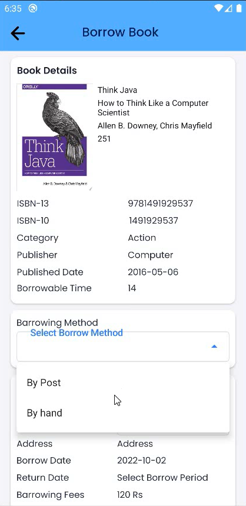

# LIBSYS---An-Android-Library-Management-System-Using-Cloud-Services
LIBSYS is an android application for efficiantly manage library and borrow books from library directly or post.

User/ Borrower Module

    
    
    
    
    

Admin/ Librarian Module

    
    
    
    
    
    
    
    
    

Features
- Admin/Librarian and User/Borrower modules.
- View which libraries have a certain book.
- Borrow book directly or post
- Send Borrow request to borrow book
- Integrated QR Code, ISBN Barcode Scanning facilitates to easily add and issue library books.
- Automated Notifications to notify borrowers when borrow request is timed out.
- Automated Notifications when borrowed book reaches its return date.

You wil need these things to build this project,
 - Android Studio
 - Firebase Auth, Firestore
 - GCloud Messaging (GCM)
 - Google Books API 
 - Google Maps API
 - Google Cloud Function API 
 - Google Cloud Scheduler API 

Future works
- RFID recoginzation issue and add multiple book at same time
- Voice Assistant and chat bot to help borrowers
- Audio books
